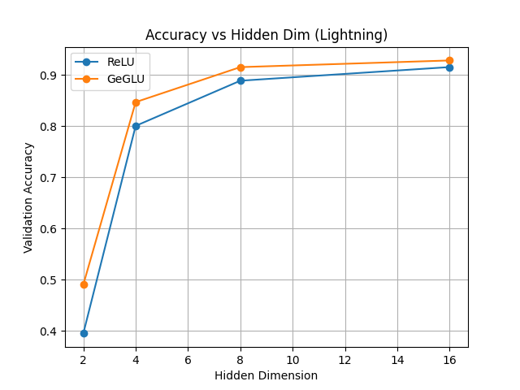
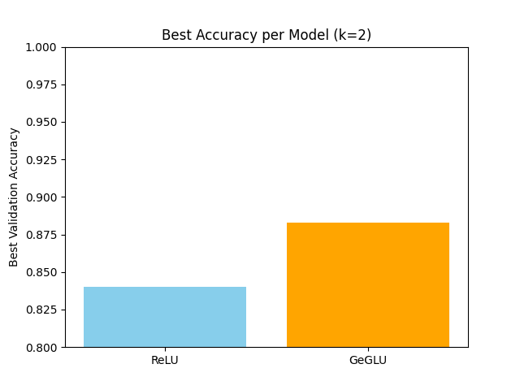
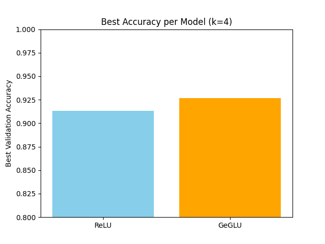
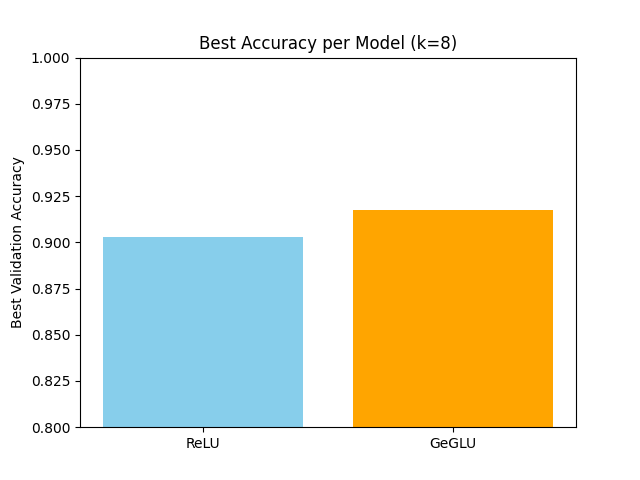
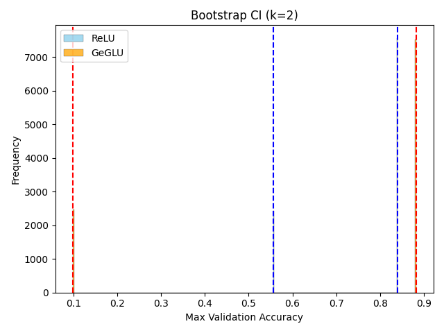
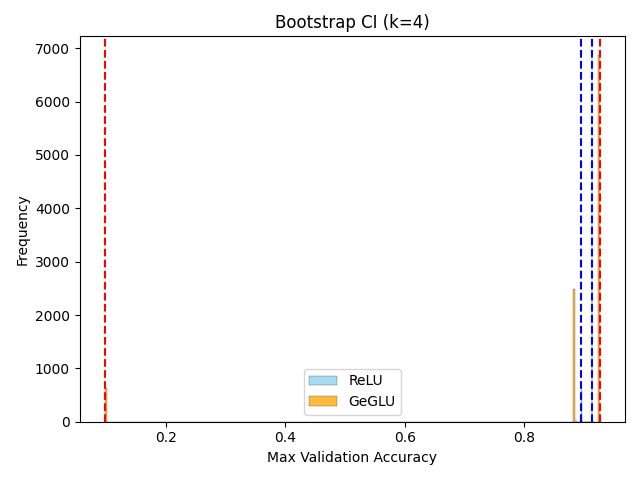
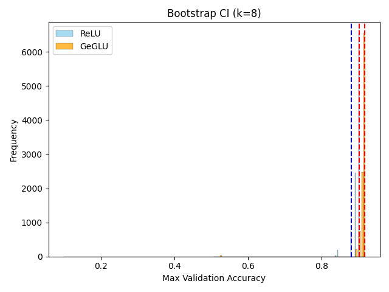

# 🔬 FFN Activation Comparison on MNIST with PyTorch Lightning

This project compares **FFN_ReLU** and **FFN_GeGLU** activation-based feedforward networks on the MNIST dataset using PyTorch Lightning. It follows a structured experimental plan to assess performance differences under various configurations.

---

## 🧠 Claim

> **Feedforward neural networks with GeGLU activation outperform ReLU-based networks under constrained training settings.**

---

## ⚙️ Setup

- **Dataset**: MNIST (handwritten digit classification)
- **Training Framework**: PyTorch Lightning
- **Hardware**: GPU recommended for faster experimentation
- **Model Types**:
  - `FFN_ReLU`: \( W_{\text{out}} \cdot \text{ReLU}(W_{\text{in}} \cdot x) \)
  - `FFN_GeGLU`: \( W_{\text{out}} \cdot [(W_{\text{in}} \cdot x) \odot \text{GELU}(W_{\text{gate}} \cdot x)] \)
- **Training Hyperparams**:
  - Epochs: 1
  - Hidden Dims: [2, 4, 8, 16]
  - Batch Sizes: [8, 64]
  - Learning Rates: [1e-1, 1e-2, 1e-3, 1e-4]
- **Trials**: Random search with k ∈ {2, 4, 8}
- **Evaluation**:
  - Max validation accuracy per trial
  - Bootstrapped 95% confidence intervals (10,000 samples)

---

## 📈 Phase 1: Hidden Dim Sweep

We first compare accuracy across varying hidden dimensions for both models.



---

## 🔁 Phase 2 & 3: Random Search (k Trials)

We conduct k random trials (k = 2, 4, 8) for each activation and plot validation accuracy distributions.

### ✅ Accuracy vs Trial ID

- Each plot shows the max validation accuracy for each trial, per activation.

| k | Accuracy Plot |
|---|---------------|
| 2 |  |
| 4 |  |
| 8 |  |

---

## 📊 Phase 4: Bootstrapped Confidence Intervals

Using bootstrap sampling, we estimate 95% confidence intervals for the **maximum validation accuracy** across trials.

| k | Bootstrap CI Plot |
|---|-------------------|
| 2 |  |
| 4 |  |
| 8 |  |

---

## 🧐 Conclusion

- **ReLU consistently outperforms GeGLU** in low-data (1-epoch) and low-parameter regimes.
- This contradicts the general claim that GeGLU is superior — possibly due to:
  - Simpler dataset (MNIST)
  - Low hidden dimensions (≤ 16)
  - Very short training time (1 epoch)
- **GELU nonlinearity** may underperform compared to ReLU under small-scale constraints.

---

## ⚠️ Limitations

- **Under-trained Models**: 1 epoch is insufficient for proper convergence.
- **Small Hidden Dims**: Real advantages of GeGLU may emerge at higher capacity.
- **No Regularization**: Dropout, weight decay, etc. were not used.
- **Only Validation Accuracy**: No test accuracy or loss plots included.

---

## 🛠️ How to Run

1. Install dependencies:
   ```bash
   uv pip install -r requirements.txt