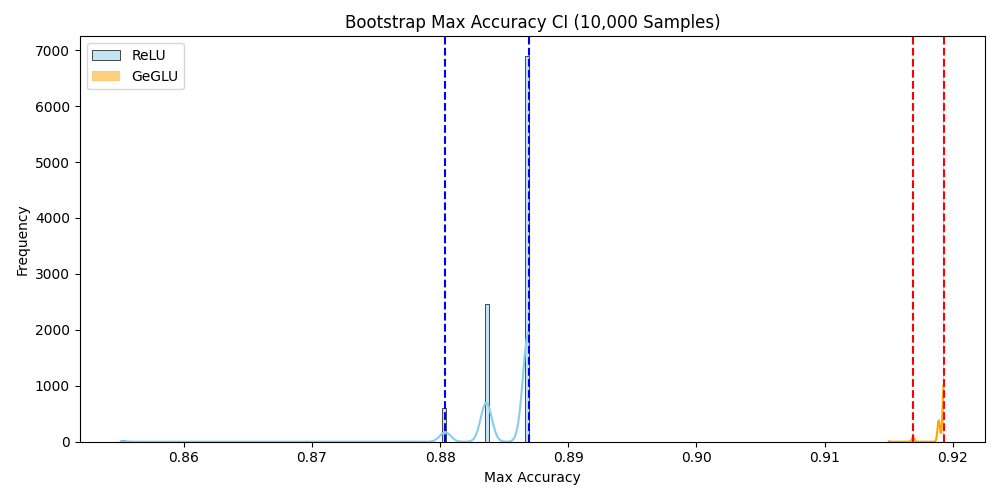
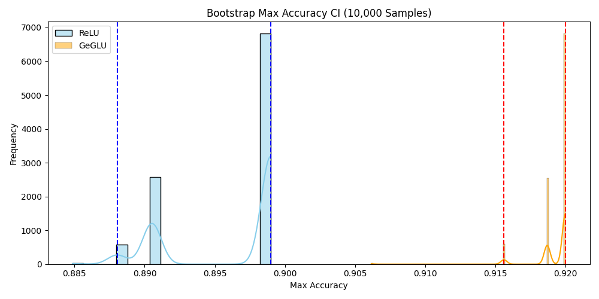

# FFN_ReLU vs GeGLU on MNIST 🧠🔢

This repository contains a comparative study of Feedforward Neural Networks using **ReLU** and **GeGLU** activations on the MNIST digit classification task. The experiments were conducted using both standard **PyTorch** and **PyTorch Lightning**, and evaluated via a range of techniques including hyperparameter search and **bootstrap estimation** of performance.

---

## 🔬 What We Did

We implemented two FFN models:
- `FFN_ReLU`: Feedforward network with ReLU activation
- `FFN_GeGLU`: Feedforward network with Gated GELU (GeGLU) activation

We compared them using the following methodology:

1. **Hidden Dimension Sweep**  
   Trained both models with varying hidden dimensions: `[2, 4, 8, 16]`

2. **Random Hyperparameter Search**  
   Sampled combinations of:
   - Batch sizes: `[8, 64]`
   - Learning rates: `[1e-1, 1e-2, 1e-3, 1e-4]`  
   across **10 trials**

3. **Multiple Trials (V1–V4)**  
   Ran each model type 4 times to capture variability in accuracy

4. **Bootstrap Estimation (10,000 Samples)**  
   Estimated the **distribution and confidence interval** of the max accuracy for each model using sampling with replacement from the 4 runs

---

## 🖼️ Results: Bootstrap Confidence Intervals

### 📘 Non-Lightning Version

### ⚡ Lightning Version

Each histogram shows the distribution of the **max validation accuracy** obtained from 10,000 bootstrap samples of V1–V4 results. Vertical dashed lines represent the 95% confidence intervals.

---

## 📁 Project Structure
